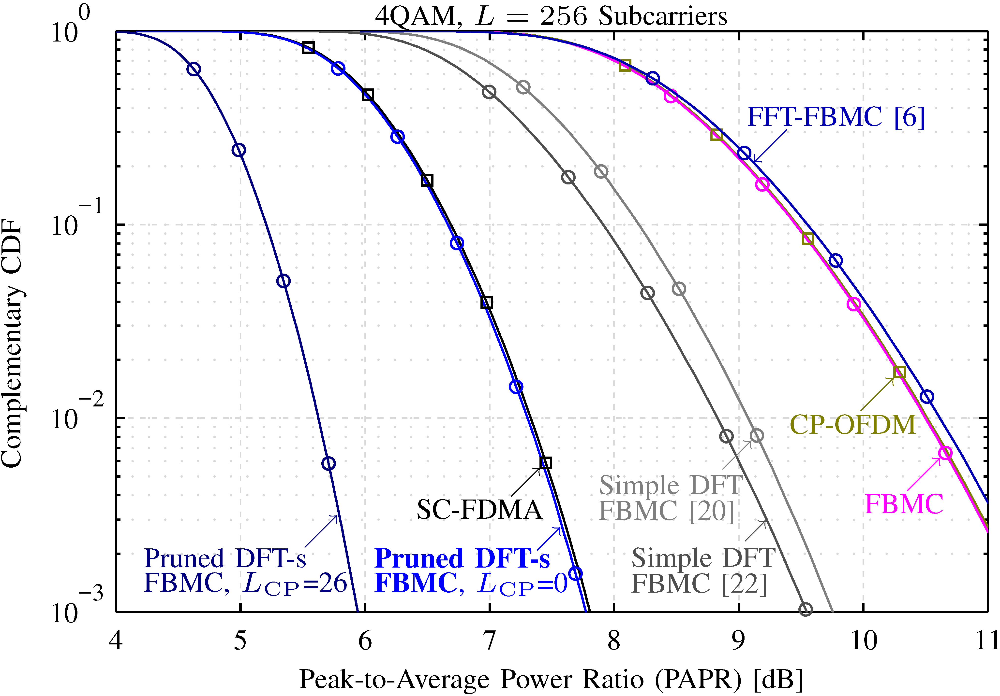
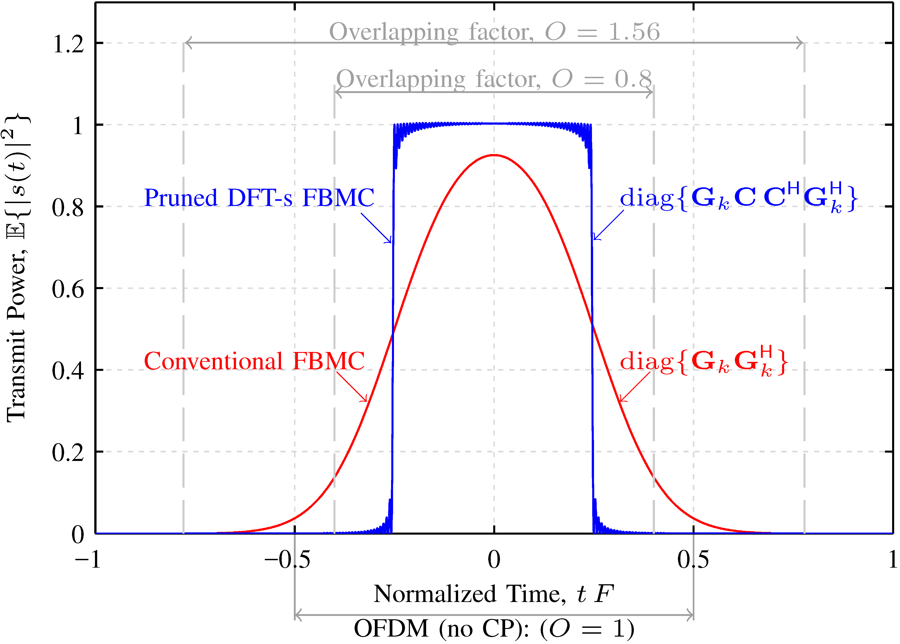
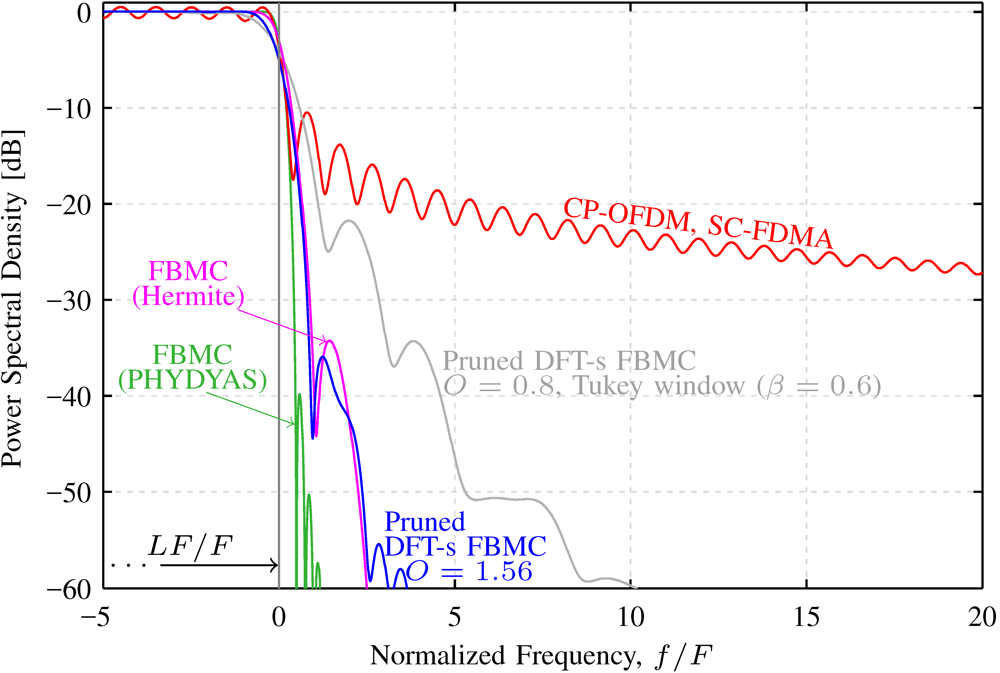
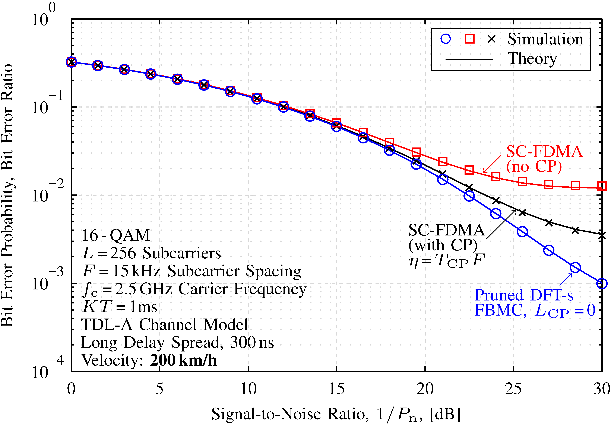

# Pruned DFT Spread FBMC

Pruned DFT spread FBMC is a novel modulation scheme with the remarkable properties of a low PAPR, low latency transmissions and a high spectral efficiency.
It is closely related to FBMC, OFDM and SC-FDMA and I first proposed it in my [PhD thesis](http://publik.tuwien.ac.at/files/publik_265168.pdf#page=117), see Chapter 6. A more detailed description can be found in R. Nissel and M. Rupp, [“Pruned DFT Spread FBMC: Low PAPR, Low Latency, High Spectral Efficiency”](https://ieeexplore.ieee.org/document/8360161/), IEEE Transactions on Communications, 2018. 
All figures from this paper can be reproduced with this repository.
 

* A [Python code](https://github.com/rnissel/Pruned-DFT-s-FBMC_Python) of pruned DFT spread FBMC with limited features (but also less overhead) can also be found on GitHub.

## Requirements
We used Windows 7 (64bit) and Matlab R2013b/2016a, but newer versions (and some older) should also work. Note that Figure 13 and 14 require the Matlab “Communications System Toolbox” for turbo coding.

## Basic Properties of Pruned DFT Spread FBMC

### Same PAPR as SC-FDMA :

----------
### Reduces the ramp-up and ramp-down period of FBMC, allowing low-latency transmissions:

----------
### Very low out-of-band emissions, comparable to FBMC: 

----------
### Outperforms SC-FDMA in doubly-selective channels:

## Reproducible Figures
All figure from [“Pruned DFT Spread FBMC: Low PAPR, Low Latency, High Spectral Efficiency”](https://ieeexplore.ieee.org/document/8360161/) can be reproduced. To keep the simulation time short, this repository uses slightly different parameters than in our paper and one has to uncomment certain lines to truly reproduce the corresponding figures.

* **Figure  1**: 
Just an illustration.	

* **Figure  2**: 
Please run [`Figure_02_BasicIdea.m`](Figure_02_BasicIdea.m).

* **Figure  3**: 
Just an illustration.

* **Figure  4**: 
Please run [`Figure_04_05_ab_TransmitPower.m`](Figure_04_05_ab_TransmitPower.m).

* **Figure  5**: 
Please run [`Figure_04_05_ab_TransmitPower.m`](Figure_04_05_ab_TransmitPower.m).

* **Figure  6**: 
Please run [`Figure_06_PowerSpectralDensity.m`](Figure_06_PowerSpectralDensity.m).

* **Figure  7**: 
Please run [`Figure_07_SignalToInterferenceRatio.m`](Figure_07_SignalToInterferenceRatio.m).  To truly reproduce Figure 7, line 19 must be uncommented. 

* **Figure  8**: 
Just an illustration.

* **Figure  9**: 
Please run [`Figure_09_PAPR.m`](Figure_09_PAPR.m). To truly reproduce Figure 9, the lines 38-39 must be uncommented. 

* **Figure  10**: 
Please run [`Figure_10_11_12_SINR_BER.m`](Figure_10_11_12_SINR_BER.m). after setting the parameter "CalculateTheory" to true. Moreover, to truly reproduce Figure 10, the lines 42-45 must be uncommented. The script must again be exectued with "Velocity_kmh=0" for the top part of Figure 10.

* **Figure  11**: 
Please run [`Figure_10_11_12_SINR_BER.m`](Figure_10_11_12_SINR_BER.m). after setting the parameter "Velocity_kmh" to zero. Moreover, to truly reproduce Figure 11, the lines 42-45 must be uncommented. 

* **Figure  12**: 
Please run [`Figure_10_11_12_SINR_BER.m`](Figure_10_11_12_SINR_BER.m). To truly reproduce Figure 12, the lines 42-45 must be uncommented.

* **Figure  13**: 
Please run [`Figure_13_Throughput.m`](Figure_13_Throughput.m). To truly reproduce Figure 13, the lines 41-44 must be uncommented.

* **Figure  14**: 
Please run [`Figure_14_FlatMIMOthroughput.m`](Figure_14_FlatMIMOthroughput.m). To truly reproduce Figure 14, the lines 43-45 must be uncommented.

----------
### Additional plots:

* [`Figure_09_PAPR.m`](Figure_09_PAPR.m) additionally shows:
	* Simulated transmit power over time
	* Simulated power spectral density
* [`Figure_10_11_12_SINR_BER.m`](Figure_10_11_12_SINR_BER.m) additionally shows:
	* BER of OFDM, OFDM (no CP) and FBMC-OQAM
* [`Figure_13_Throughput.m`](Figure_13_Throughput.m) additionally shows:
	* Throughput of OFDM, OFDM (no CP) and FBMC-OQAM

----------
### Additional Matlab files:
* [`Info_ComputationalComplexity.m`](Info_ComputationalComplexity.m): Compares the computational complexity of pruned DFT spread FBMC, SC-FDMA and "Low PAPR FBMC".
* [`Info_SpectraleffciencyInfSubcarriers.m`](Info_SpectraleffciencyInfSubcarriers.m): Compares the spectral efficiency of OFDM and SC-FDMA for infinitely many subcarriers (SC-FDMA is equivalent to pruned DFT spread FBMC). 

## Please Cite Our Paper

    @ARTICLE{Nissel2018,
		author  = {R. Nissel and M. Rupp},
		journal = {IEEE Transactions on Communications},
		title   = {Pruned {DFT} Spread {FBMC}: Low {PAPR},Low Latency, High Spectral Efficiency},
		year    = {2018},
		volume  = {},
		number  = {},
		pages   = {}, 
		doi     = {10.1109/TCOMM.2018.2837130},
		ISSN    = {},
		month   = {},
	}

## References
- R. Nissel and M. Rupp, [“Pruned DFT Spread FBMC: Low PAPR, Low Latency, High Spectral Efficiency”](https://ieeexplore.ieee.org/document/8360161/), IEEE Transactions on Communications, 2018 to appear.
- R. Nissel, [“Filter bank multicarrier modulation for future wireless systems”](http://publik.tuwien.ac.at/files/publik_265168.pdf), Dissertation, TU Wien, 2017.

